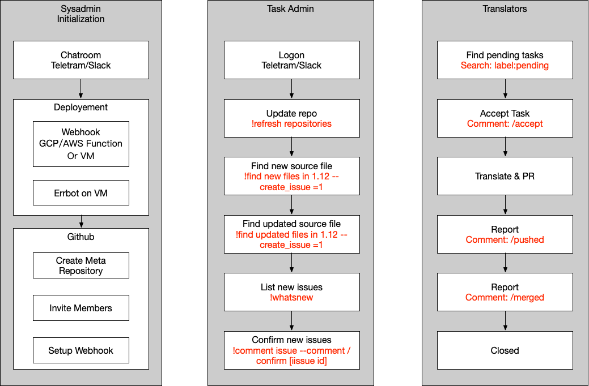

# issueflow <!-- omit in toc -->

本项目支撑了 Istio 和 Kubernetes 的文档中文化流程，它以 Github Issue 为工作对象，通过 Chatbot 和 Webhook 相结合的方式，为翻译工作提供了任务管理的支撑功能。

- [总体工作流程](#%E6%80%BB%E4%BD%93%E5%B7%A5%E4%BD%9C%E6%B5%81%E7%A8%8B)
- [任务（Issue）的状态转换](#%E4%BB%BB%E5%8A%A1issue%E7%9A%84%E7%8A%B6%E6%80%81%E8%BD%AC%E6%8D%A2)
- [Slack(chat) bot 的使用](#slackchat-bot-%E7%9A%84%E4%BD%BF%E7%94%A8)
  - [运行配置](#%E8%BF%90%E8%A1%8C%E9%85%8D%E7%BD%AE)
    - [目录结构](#%E7%9B%AE%E5%BD%95%E7%BB%93%E6%9E%84)
    - [配置文件](#%E9%85%8D%E7%BD%AE%E6%96%87%E4%BB%B6)
    - [启动脚本](#%E5%90%AF%E5%8A%A8%E8%84%9A%E6%9C%AC)
  - [Bot 指令](#bot-%E6%8C%87%E4%BB%A4)
- [Webhook 的使用](#webhook-%E7%9A%84%E4%BD%BF%E7%94%A8)
  - [配置文件](#%E9%85%8D%E7%BD%AE%E6%96%87%E4%BB%B6-1)
  - [环境变量](#%E7%8E%AF%E5%A2%83%E5%8F%98%E9%87%8F)
  - [Github 设置](#github-%E8%AE%BE%E7%BD%AE)

## 总体工作流程

该项目首先假设了上游的最小（无）支持，因此目前尚未支持上游项目的接入和互动。

1. 首先创建一个 Repository，用于进行任务管理。

1. 将所有翻译组成员加入该项目，以便进行任务（也就是 Issue）分发。

1. 初始化 Chatbot 及其运行环境。

1. 在 Chatbot 中进行任务的创建和更新。

1. 初始化 Webhook 及其运行环境。

1. 将任务仓库的 Webhook 挂接到建立好的 Webhook 上。

1. 译者开始通过在 Issue 中加入 Comment 的方式进行翻译和进度汇报。

1. Webhook 识别 Issue 中的 Comment，进行相应的标识和跟踪。

总体工作流程如图所示：

## 任务（Issue）的状态转换

任务以 Issue 方式来体现，用标签来标注任务状态。

> 下列状态和指令都可以在 Webhook 中进行配置。

- Welcome：新建的 Issue 会标注为这一标签，Issue Body 中会包含该任务的对应源文件，需由管理员确认后进入工作流程。确认有两种方式：

    - Comment：`/confirm`。
    - 修改标签，去掉 Welcome，加入 Pending。

- Pending：待认领任务，翻译组成员可以认领该任务。认领 Comment：`/accept`

- Translating：翻译进行中，任务认领后 Issue 会指派给认领的翻译组成员。

- Pushed：翻译基本完成后，译者发送 PR 到文档项目，在该 Issue 中输入 `/pushed`。

- Finished：PR 已经完成合并后，译者在 Issue 中加入 `/merged`，任务关闭。

## Slack(chat) bot 的使用

### 运行配置

#### 目录结构

为 Bot 新建目录，大致结构如下：

- config：放置配置文件。

- data：Bot 数据。

- repository：代码仓库。下面可以有多个分支

#### 配置文件

Bot 的配置文件是一段 yaml 代码，例如 Istio 项目目前使用的配置：

~~~yaml
repositories:
  istio:
    github:
      task:
        owner: servicemesher
        repository: istio-official-translation
      code:
        owner: istio
        repository: istio.io
    valid_extensions:
    - ".md"
    priorities:
    - patterns: ['^\/blog\/.*?$', '^\/news\/.*?$', '^\/faq\/.*?$', '^\/about\/.*?$']
      labels: ['priority/P3']
    - patterns: ['^\/docs\/reference\/.*?$']
      labels: ['priority/P2']
    - patterns: ['^\/docs\/ops\/performance-and-scalability\/.*?$', '^\/docs\/ops\/diagnostic-tools\/.*?$', '^\/docs\/examples\/multicluster\/.*?$', '^\/docs\/examples\/mesh-expansion\/.*?$', '^\/docs\/setup\/upgrade\/.*?$', '^\/docs\/setup\/deployment-models\/.*?$', '^\/docs\/setup\/additional-setup\/.*?$']
      labels: ['priority/P1']
    - patterns: ['^\/.*?$']
      labels: ['priority/P0']
    branches:
    - name: "1.4"
      target_branch: master
      path: "/errbot/repository/master"
      url_prefix:
        source: "https://github.com/istio/istio.io/tree/master/content/en"
      labels:
      - version/1.4
      ignore: ['^\/test\/.*?$', '^\/boilerplates\/test.*?$']
    source:
      name: en
      path: content/en
    languages:
    - name: zh
      path: content/zh
      labels:
      - lang/zh
      target_labels:
      - translation/chinese
    status:
      pushed: pushed
      merged: merged
      pending: pending
      working: translating
~~~

#### 启动脚本

在启动脚本中需要为 Bot 的运行设置一些环境变量。

~~~bash
#!/bin/sh
docker run -d --name=istio-slack-bot \
        --restart=always \
        -e BOT_LOG_LEVEL=INFO \ # 日志输出级别
        -e BOT_ADMINS=@1527062125 \ # 管理员的 Slack 名称
        -e REPOSITORY="istio" \ # 配置文件中的 Repository 名称
        -e REPOSITORY_CONFIG_FILE="/errbot/config/repository.yaml" \ # 配置文件名称
        -e MAX_RESULT=10 \ # 单次最大输出数量
        -e MAX_WRITE=500 \ # 单次最大写入数量
        -e TARGET_LANG="zh" \ # 翻译语种名称
        -e BOT_TOKEN="xoxb-" \ # Slack Bot 的 Token
        -e BACKEND="Slack" \ # 指定使用 Slack 后端
        -e CRITICAL_COMMANDS="find_new_files_in,find_updated_files_in,find_deleted_files_in,cache_issue,confirm_recent_new_issues,find_delay_issues" \ # 关键命令列表
        -e OPERATORS="@1527062125" \ # 可以执行关键命令的操作员
        -e PRIVATE_COMMANDS="whatsnew,github_bind,github_whoami" \ # 仅能在私聊窗口中使用的命令
        -v $(pwd)/data:/errbot/data \ # Bot 的存储路径
        -v $(pwd)/config:/errbot/config \ # Bot 的配置路径
        -v $(pwd)/repository:/errbot/repository \ # 代码库路径
        shidaqiu/translate-chatbot:1.3 # 镜像名称
~~~

### Bot 指令

Bot 启动之后，会在 Slack 中看到对应的 App 上线，可以对其发出指令，完成任务。指令前缀为 `!`

- `github bind [your github token]`: 将你的个人 Token 绑定到 Bot 上，就可以用自己的身份来完成这些任务。

- `github whoami`：校验指令，查看是否已经绑定。

- `cache issue`：缓存所有开放任务。

- `find new files in [branch name]`：从指定分支中查找新的未翻译文件，`branch name` 来自上文的配置文件，如果加入开关 `--create_issue=1`，则会根据新文件来创建任务。

- `find updated files in [branch name]`：在指定分支中查找翻译后更新的内容，参数和开关和新建指令一致。新建批量大小受环境变量控制。

- `whatsnew`：查找新建未确认任务。

- `show issue [issue id]`：根据 issue 编号展示 issue 链接。

- `search issues [query]`：按照 Github 语法，搜索 Issue。

## Webhook 的使用

目前支持 Flask App 和 GCP Function 两种方式的部署，进入目录执行对应的 `xxx-build.sh` 即可完成打包。

> GCP 日志写入需要使用 `permission.json`，这部分代码需要自行定制。

### 配置文件

目前的工作流定义通过一个 YAML 来完成。下面是 Istio 项目的配置说明

~~~yaml
workflow:
- name: "istio" # 项目名称
  labels: # 可用标签
  - group: "status" # 标签分组，可以基于分组进行互斥设置。
    labels:
      - "welcome"
      - "pending"
      - "translating"
      - "pushed"
      - "finished"
  events:
    on_issue: # Webhook 的触发动作。
    - name: "new_issue"
      description: "A new issue had been created."
      regex: opened # 触发的具体事件
      conditions: [] # 执行动作的要求条件
      actions: # 执行动作
      - type: label # 打标签
        value:
          group: status # 标签分组
          label: welcome # 标签内容
          mutex: True # 互斥
    on_comment:
    - name: "confirm"
      description: "Accept an new issue as a task."
      regex: \/confirm # /confirm 指令
      conditions:
      - type: labels
        value: # 必须包含如下标签
        - "welcome"
        failed_actions: # 如果不满足条件，则执行
        - type: comment # 加入 Comment，内容见后
          value: "Sorry @%operator%, only issues with label `welcome` can be confirmed."
      - type: state # 状态必须是 open
        value: "open"
        failed_actions:
        - type: comment
          value: "Sorry @%operator%, only active issues can be accepted."
      - type: assigned # 尚未分派的任务
        value: False
        failed_actions:
        - type: comment
          value: "Sorry @%operator%, only issues had not been assigned can be confirmed."
      - type: user_in_list # 用户属于管理员组
        value:
        - "%admin%"
        failed_actions:
        - type: comment
          value: "Sorry @%operator%, you are not allowed to confirm this issue."
      actions: # 通过检查后，打标签 pending。
      - type: label
        value:
          group: status
          label: pending
          mutex: True
    ...
~~~

### 环境变量

- `GITHUB_TOKEN`：用于完成 Issue 操作的 Token。

- `ADMINS`：能完成管理指令的用户名称。

- `INTERVAL`：写入操作的间隔时间，防止超限。

- `WORKFLOW`：配置文件中的工作流名称。

### Github 设置

将任务仓库的 Webhook 设置为部署地址，并选择 Issue 和 Issue_comment 触发。